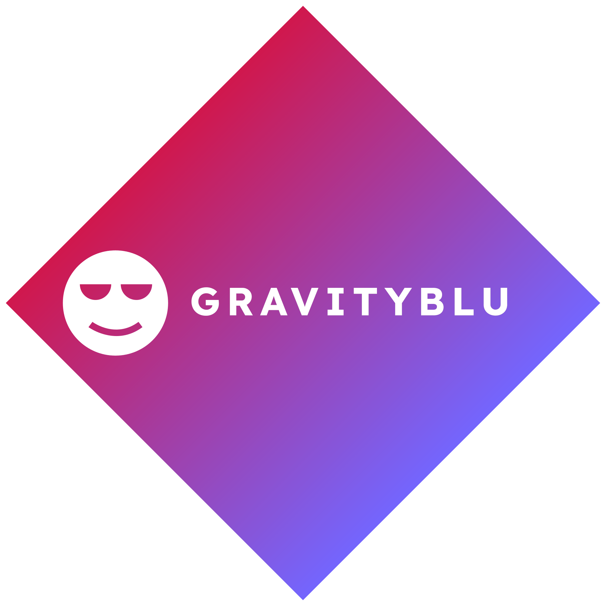

<h1>GravityBlu</h1>

    
    <h2> A simple youtube downloader GUI built with yt-dlp </h2>

    
    

        <h3>Supports Downloading Higher Resolutions</h3>
        
    

    

        <h3>Parallel Downloads</h3>
        
    

    

