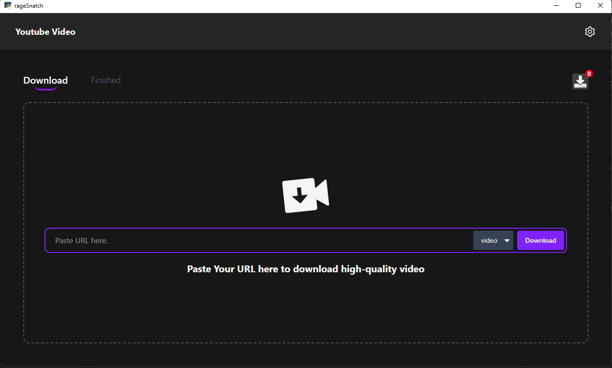
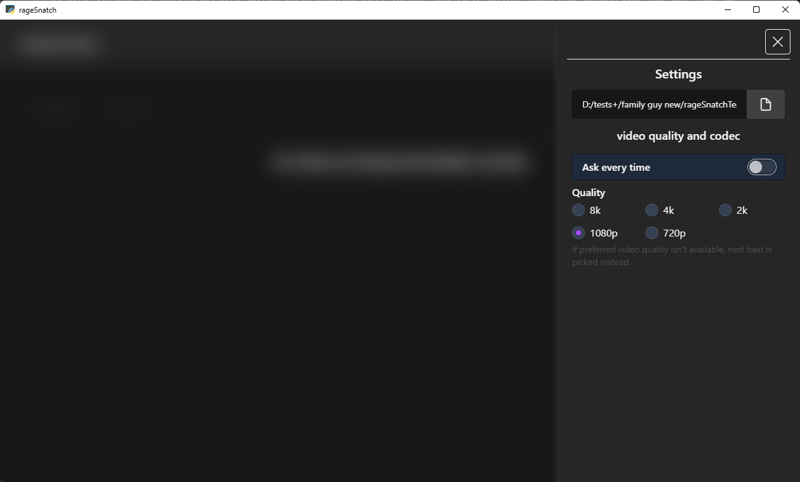
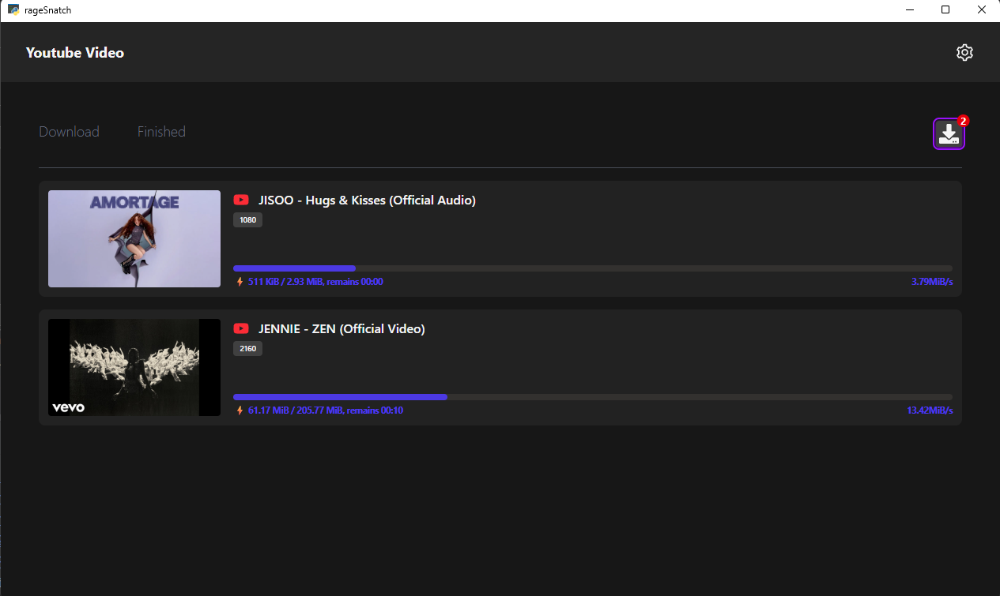
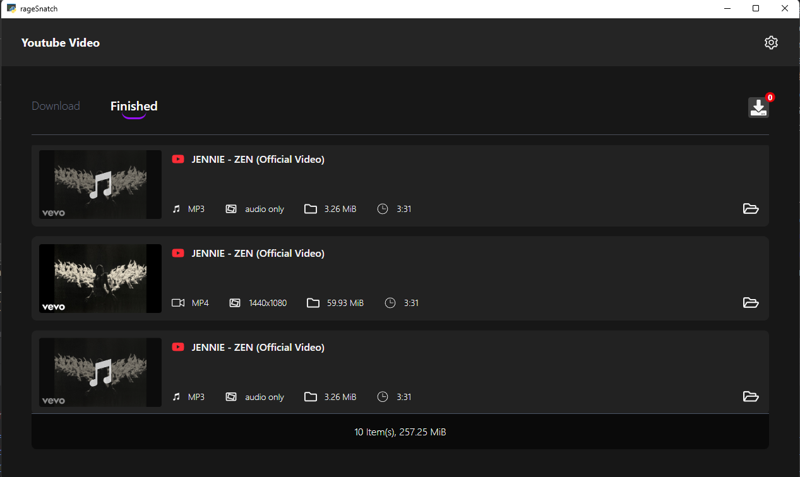

# GravityBlu
1. A YouTube downloader GUI built with pywebview and yt-dlp

## How To Run
### development mode
- git clone https://github.com/nidhish17/gravityBlu.git
- first install frontend packages
  - cd frontend
  - npm i 
- Run development server
  - npm run dev
  - (vite server looks like) &rarr; http://localhost:5173
- Launch App
  - cd backend
  - create virtual environment (use pycharm it automatically creates one for you) ❤️JetBrains
  - install packages
    - pip install -r requirements.txt
  - Run setup.py (if your frontend server is different then replace the url argument in webview.create_window with your frontend server url)
- Upgrading packages
  - if downloader does not work for some reason make sure the yt-dlp package is up-to-date
    - you can check by using the cmd &rarr; pip show yt-dlp
    - crosscheck in pypi website &rarr; https://pypi.org/project/yt-dlp/ 
    - if update is available then upgrade it by using t5his cmd
      - pip install yt-dlp -U
- To freeze app using pyinstaller
  - <pre lang="python">
      pyinstaller backend/production.py --name="GravityBlu" --onefile --icon="assets/icon.png" --add-data "./backend/frontend_production;frontend_production" --noconsole
    </pre>

## Known Issues
- [x] ~~Fix a minor bug: downloading two videos with the same ID causes their progress trackers to collide,
this will be addressed in a future release.~~

- [x] ~~if user changes quality then the downloaded video is not the same quality the user chose even if the
video's res is available ie due to init/variable being read during init phase and that being accessed everytime and not the current quality that the user selected!~~

- [ ] sometimes video download just doesn't start you might have to re-try.
  - SABR forcing error
  - formats skipped due to SABR

- [ ] updater.exe opens with console (was used to debug) use --windowed flag and remove the console

## Missing Features
- currently you cannot download age restricted videos
  - cookies auth has not been implemented yet

- [x] ~~youtube to mp3~~
- [x] direct app updates
- [ ] youtube tags extractor
- [ ] download thumbnails
- [ ] implement cookies auth (!⚠️ High Priority)
- [ ] add download feature for other platforms too (other than youtube) (!⚠️ High Priority)

## Tech stack used
1. Tailwind Css
2. pywebview (python lib)
3. React (vite) + Zustand
4. sqlite
5. yt-dlp (Core of the app)
6.

## Dev Notes
### ⚠️ 👽👽👽🧨🧨🧨🧨🧨🧨🧨🐦‍🔥 ALWAYS REMEMBER TO UPDATE THE "__ VERSION __" VARIABLE ELSE UPDATING FEATURE WILL NOT WORK ⚠️
- [x] implement updating feature to app
- [ ]

## Guidelines for releases for updater to work
1. tag name should be in the format 2.0.0 -> x.x.x
2. first release of the app version is 2.0.0
3. for later releases depending on the complexity of update name 2.x.x
4. for small features and bug fixes increment 2.0.x
5. for major updates increment 2.x.0 or x.0.0

# while uploading the exe to github for update the tag name should be a new one and it shoould match the new version so the fix works
